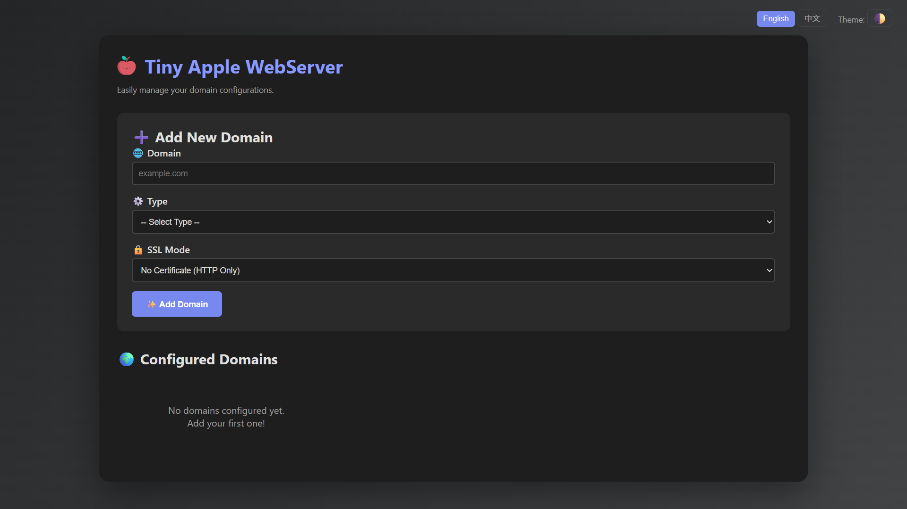

# Tiny Apple Server 🍎

[English](./README.md) | [繁體中文](./README_zh-TW.md)

A lightweight, multi-domain web server written in Go, featuring a user-friendly web GUI for easy configuration. It's designed to be a simple alternative to complex tools like Nginx or Caddy for managing multiple small projects.



## ✨ Key Features

-   **Web-based GUI**: Manage all your domains from a clean and modern web interface running on a separate port (`:9999`).
-   **Multi-Domain Support**: Host multiple websites on a single server, with requests routed based on the hostname.
-   **Multiple Server Modes**: Configure each domain to operate in one of three modes:
    -   **📁 File Server**: Serve static files (HTML, CSS, JS, images).
    -   **🐘 PHP Server**: Execute PHP applications via a PHP-FPM socket.
    -   **🔄 Reverse Proxy**: Forward requests to other backend services (e.g., Node.js, Python, Java apps).
-   **Comprehensive SSL Management**:
    -   **Let's Encrypt**: Automatic SSL certificate generation and renewal.
    -   **Custom Certificates**: Use your own SSL certificate files.
    -   **Self-Signed Certificates**: Automatically generate self-signed certificates for development purposes.
    -   **Insecure Skip Verify**: For Reverse Proxy mode, you can choose to ignore self-signed SSL certificates on backend targets.
-   **Modern UI**:
    -   **Dark/Light Mode**: Automatically detects system preference and allows manual switching.
    -   **i18n Support**: Switch between English and Traditional Chinese.

## 🚀 Getting Started

### Prerequisites

-   **Go**: Version 1.18 or higher is recommended.
-   **PHP-FPM** (Optional): Required only if you intend to use the PHP Server mode.

### Installation & Running

1.  **Clone the repository:**
    ```bash
    git clone https://github.com/your-username/tiny-apple-server.git
    cd tiny-apple-server
    ```

2.  **Install dependencies:**
    Go will handle this automatically when you run the application. If you want to install them manually:
    ```bash
    go mod tidy
    ```

3.  **Run the application:**
    The server needs to bind to ports 80 and 443, which requires administrator privileges.

    ```bash
    sudo go run .
    ```
    You will see log messages indicating that the admin panel and the main web services have started.

## 🛠️ How to Use

### 1. Management Panel

-   Open your web browser and navigate to `http://localhost:9999/admin`.
-   Use the form to add new domains.
-   For each domain, you must specify:
    -   A unique **Domain** name (e.g., `test.local`, `my-project.com`).
    -   A **Type** (File Server, PHP Server, or Reverse Proxy).
    -   The corresponding settings for the chosen type (e.g., Root Directory, PHP-FPM Socket, Target URL).
    -   An **SSL Mode** for handling HTTPS traffic.

### 2. Web Server

-   Once a domain is configured, the server will automatically handle requests on ports 80 (redirecting to HTTPS) and 443.
-   Make sure your domain's DNS records point to the server's public IP address for Let's Encrypt and public access to work correctly.

## ⚙️ Configuration

-   **`config.json`**: All domain configurations are automatically saved to this file in the root directory. You can manually edit it, but using the GUI is recommended.
-   **`/static/`**: This directory contains all the frontend assets for the admin panel (HTML, CSS, JS, and the icon).
-   **`/certs/`**: This directory is automatically created to cache the certificates obtained from Let's Encrypt.

## 🤝 Contributing

Contributions are welcome! Please feel free to open an issue or submit a pull request.

## 📄 License

This project is licensed under the MIT License.